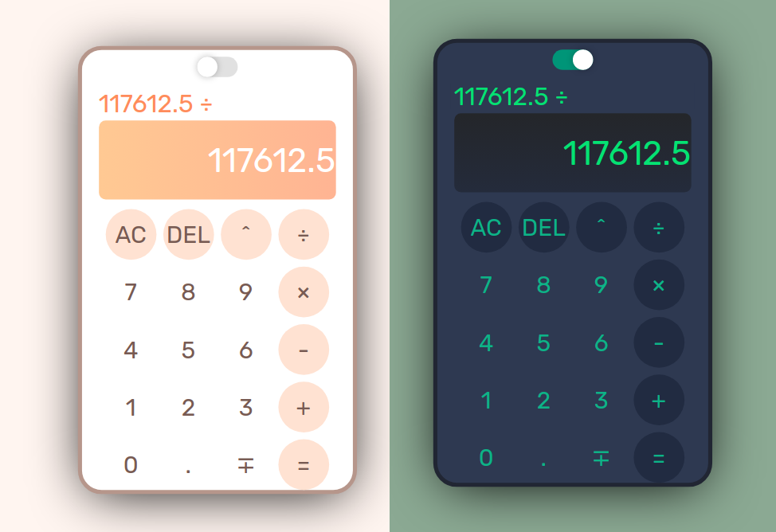

# Calculator

This is a basic arithmetic calculator created using HTML & CSS and Javascript.

## Technologies Used

- HTML
- CSS
- Javascript
- Git

## Features

- Basic Arithmetic Operations: Perform addition, subtraction, multiplication, and division calculations.
- Sequential Calculation: Perform calculations in a step-by-step manner, evaluating one pair of numbers and operators at a time.
- Exponentiation Functionality: Integrate a power button to calculate exponential expressions. 
- Decimal Support: Ability to work with decimal numbers for precise calculations.
- Clear and delete buttons: Clear and delete the current input or calculation with ease.
- Toggle Sign Button: Quickly switch between positive and negative numbers using this button.
- Theme Options: Offer light and dark color themes for personalizing the app's appearance.

## Demo

Check out the live demo: [Calculator Demo](https://eliptik1.github.io/calculator/)

## Screenshots

## License

This project is open-source and available under the MIT License.